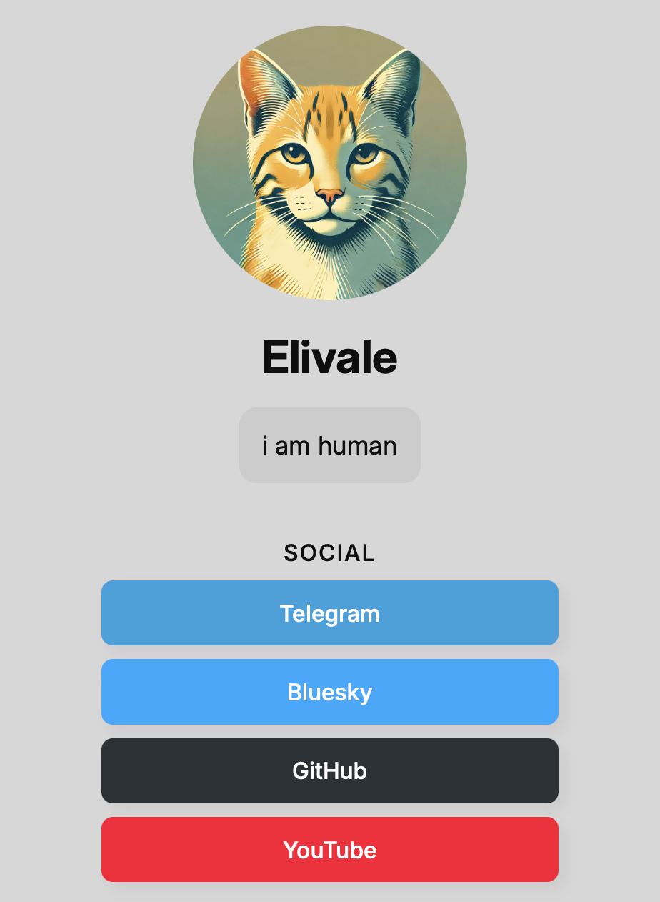

<div align="center">
<h1>Clover</h1>

<p>
<i>
Easy to run and use, self-hosted web profile & link shortener
</i>
</p>
</div>

## Configuration

Typical `config.json` file looks like this:

```jsonc
{
  "address": ":80",
  "avatar": "https://.../avatar.png", // avatar URL
  "name": "My Cool Name",
  "bio": "My Cool Bio",
  "links": [
    // Button example
    {
      "name": "Some Social",
      "url": "https://...",
      "symlink": "some_social", // used in URL shortener. In this example, https://<your-host>/some_social will redirect to a specific URL
      "background": "#000", // background color
      "foreground": "#fff" // text color
    },

    // Label example
    {
      "isLabel": true,
      "name": "MUSIC"
    }
  ]
}
```

## Run using Docker

```sh
$ docker run -d -p 80:80 -v ./config.json:/clover/config.json --name clover eliva1e/clover
```

## TODO

1. Icons for the buttons
2. SSL certificate support
